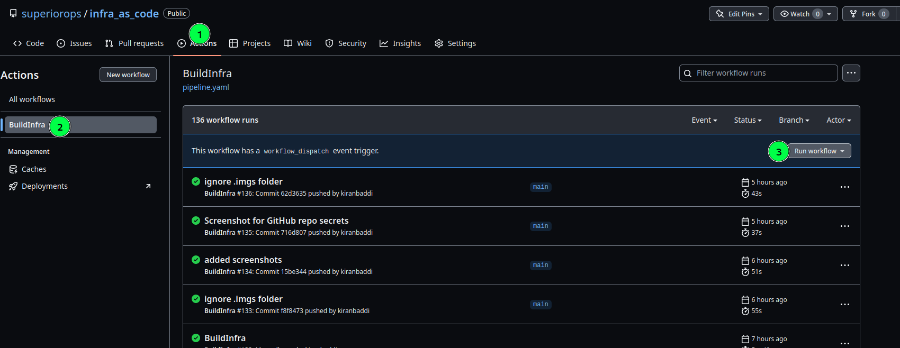

   
  


# Workflow to provision Infra on Azure with Terraform


## Motivation

A simple Infra-As-Code ~~pipeline~~ *Workflow* to demonstrate various features of **GitHub Actions**. 
This *workflow* does the following:
1. Set up required Storage Account and storage contianer for [Terraform remote backend](https://learn.microsoft.com/en-us/azure/developer/terraform/store-state-in-azure-storage?tabs=azure-cli).
2. Create [ or destroy ] multi-tier IaaS infrastructure on Azure with Terraform. 
   The workflow creates the following  resources when `Apply` Action is used
    1. VPC
    2. 3 Subnets - Web, App, DB + Security Group for each subnet
    3. Desired number of VM instances in each subnet 
    4. A Load balancer for Web servers
3. Output the values when "Apply" parameter is used.     

## Tools used

1. [Azure CLI](https://learn.microsoft.com/en-us/cli/azure/)
2. Bash 
3. [Terraform](https://www.terraform.io/)

## Pre-requisites

1. GitHub Account [with Actions enabled]
2. Azure Subscription
3. Azure service prinicipal with contributor access at the subscription level.


## Setup
1. Check-in the code to a repository in your GitHub

2. Create the Environment by going to Repository settings :arrow_right:  Environments :arrow_right: New environment
`.github/workflows/pipeline.yaml` raw=true "Add Environment")

3. Create a Azure Service Principal with SDK authorization using the below command
    [ if you don't have Azure CLI locally installed, you can  use [Azrue Cloud Shell](https://learn.microsoft.com/en-us/azure/cloud-shell/overview) ]

```bash
az ad sp create-for-rbac --name <name_for_the_sp> --role contributor --scopes /subscriptions/<subscription_id>  --sdk-auth
```

 

4. Save the output of the above command as a Variable named `AZ_CREDENTIALS`.

5. Also, create the following secrets :
     
    |Secret| Description|
    |------|------------|
    |AZURE_SUBSCRIPTION_ID| Subscription ID of your Azure subscription|
    |AZURE_TENANT_ID|Tenant ID of your Azure subscription|
    |ARM_CLIENT_ID| clientid of the service principal|
    |ARM_CLIENT_SECRET|clientsecret of the service principal|


## Provision Infrastructure

To provision Infrastructure update [dev.env](./dev.env) with the required values and update Action env `variable` in [workflow file](.github/workflows/pipeline.yaml) to `Apply`  and check-in the code to your repository.

To deprovision/delete the infrastructure update update Action env `variable` in [workflow file](.github/workflows/pipeline.yaml) to `Destroy`  and check-in the code to your repository

## Manually run the pipeline. 

This workflow can be triggered manually as well. To run the workflow manually follow the below steps:

1. Go to GitHub repository :arrow_right: Actions :arrow_right: Run Manually



2. Choose Action as `Apply` to provision and `Destroy` to delete the infrastructure.


### Todo

- [ ] Refactor to allow mult-environments
- [ ] Feature to pick up no. of nodes from GitHub Actions manual trigger
- [ ] Refactor Terraform Code for Modularity 